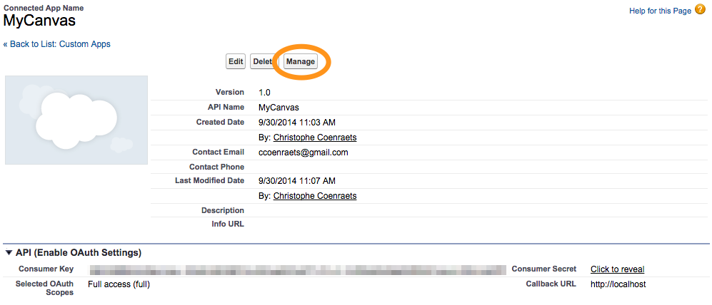
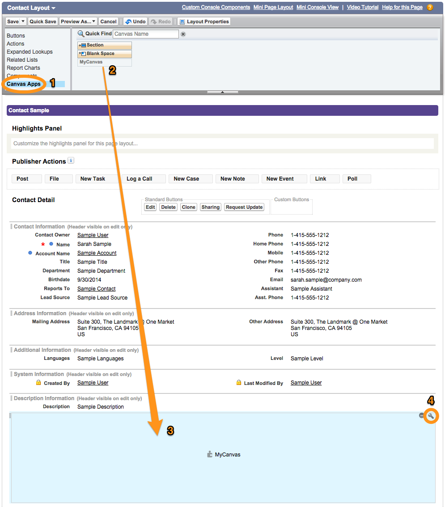
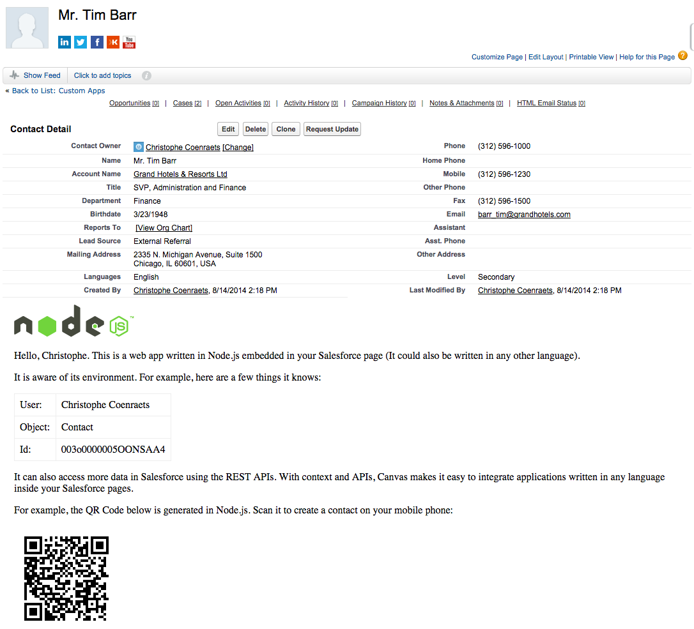

In this module, you deploy a Node.js application to Heroku using the Heroku button. You define a Canvas application to integrate the Node.js application in Salesforce, and you add the Canvas application to the Contact Page Layout.

## Step 1: Create a Connected App

1. In Setup, click **Build** > **Create** > **Apps**

1. In the **Connected Apps** section, click **New**, and define the Connected App as follows:
  - Connected App Name: **MyCanvas**
  - API Name: **MyCanvas**
  - Contact Email: **enter your email address**
  - Enabled OAuth Settings: **Checked**
  - Callback URL: **http://localhost** (you will change this later)
  - Selected OAuth Scopes: **Full Access (full)**
  - Force.com Canvas: **Checked**
  - Canvas App URL: **http://localhost/signedrequest** (you will change this later)
  - Access Method: **Signed Request (POST)**
  - Locations: **Layouts and Mobile Cards, Publisher**

1. Click **Save**

1. On the Connected App details page, click the **Click to reveal** link next to **Consumer Secret**, and copy your secret to your clipboard. You will need it in step 4.

    

## Step 2: Configure Permissions

1. On the Connected App details page, click the **Manage** button

    

1. Click **Edit**

1. For Permitted Users, select **Admin approved users are pre-authorized**

1. Click **Save**

1. Click **Manage Profiles**

1. Check **System Administrator**

1. Click **Save**

## Step 3: Sign Up for Heroku

> You can skip this step if you already have a Heroku account.

1. Open a browser and access the following URL: 

    [http://heroku.com/signup](http://heroku.com/signup)

1. Enter an email address you have access to at this time (you will need to open an activation email) and click **Signup**

1. Check your email. You will receive an activation email for your Heroku account.

1. Click the link in the activation email. Enter your new password information, and click **Save**.

## Step 4: Deploy the App to Heroku

1. Access the following GitHub repository:

    [https://github.com/ccoenraets/salesforce-canvas-demo](https://github.com/ccoenraets/salesforce-canvas-demo)

1. Click the server.js file and examine the code:

    The server defines a **/signedrequest** endpoint configured to respond to **POST** requests. This is the endpoint you specified in the Canvas parameters of your Connected App. When loading your Canvas app, your Salesforce instance will post encoded data to that endpoint including contextual information (logged in user, current object, ...), and an authenticated session id that your app can use to make API calls to your Salesforce instance. 
    
1. Go back to the repository home page and click the **Deploy to Heroku** button
    
    - For **App Name**, specify a name for your application. For example, if you specify my-canvas, your application will be available at http://my-canvas.herokuapp.com. Your app name has to be unique on the herokuapp.com domain.
    - For **CONSUMER_SECRET** in the deployment wizard, paste the consumer secret of the connected app you copied in step 1.
    - Click the **Deploy For Free** button

1. In Salesforce, go back to your Connected App and adjust the URLs based on your Heroku app name:
     - For **Callback URL**, specify: https://my-canvas.herokuapp.com
     - For **Canvas App URL**, specify: https://my-canvas.herokuapp.com/signedrequest
     
     > Replace **my-canvas** with your own app name.

     
## Step 5: Add the Canvas App to the Page Layout

1. In **Setup** mode, select **Build** > **Customize** > **Contacts** > **Page Layouts**

1. Click **Edit** next to **Contact Layout**

1. Select **Canvas Apps** in the upper left corner, drag **MyCanvas**, and drop it immediately after the Description field.

1. Mouse over the Canvas in the layout, click the wrench in the upper right corner, specify **550** for the Canvas Height, and click OK.

1. Click **Save** (upper left corner) to save the layout

## Step 6: Test the Application

1. Access a Contact

1. The Canvas application should appear in the middle of the page layout

    
    
1. Scan the QR code with your mobile phone to create a new contact entry

<a href="Using-Static-Resources.html" class="btn btn-default"><i class="glyphicon glyphicon-chevron-left"></i> Previous</a>
<a href="Testing.html" class="btn btn-default pull-right">Next <i class="glyphicon glyphicon-chevron-right"></i></a>

